# Google Genomics API... Wait! Genomics?!

## Google Genomics
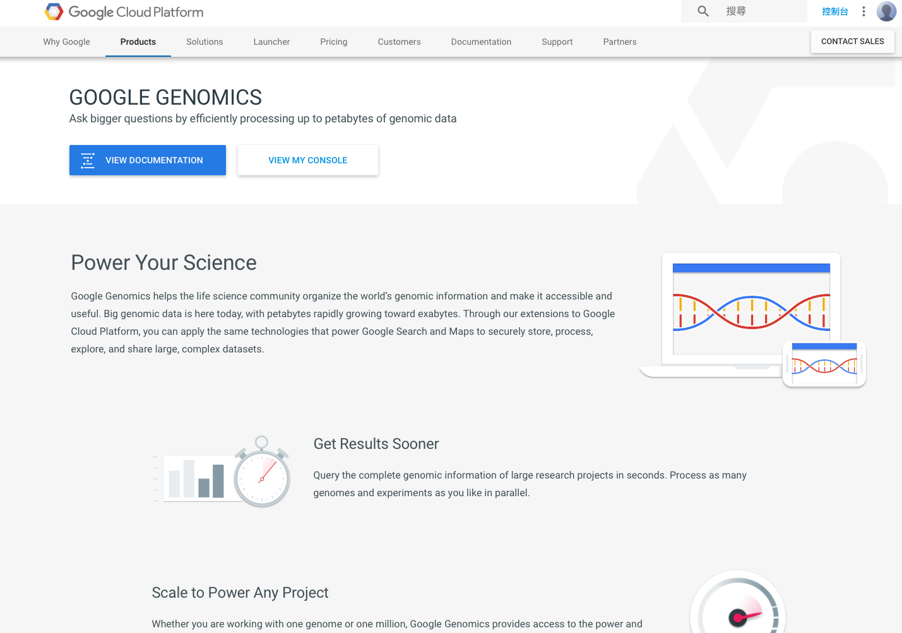

## 放入括弧，存而不論

## Bioinformatics

# Basic Biology

## From human body to DNA

## DNA

## Analogy between biology and computer science

## Human Genome Project
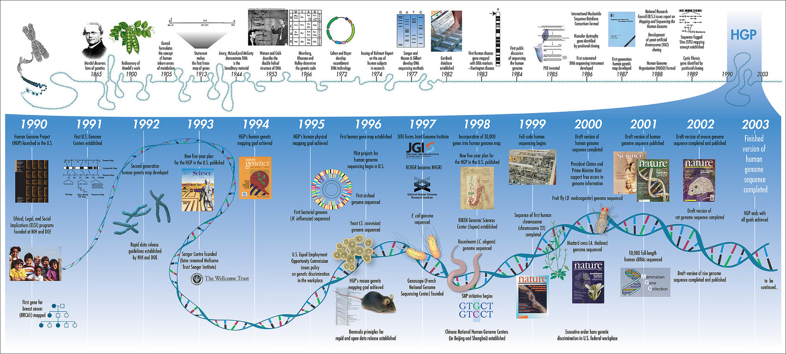

## Is it the end?

## How does genetic variation affect us?
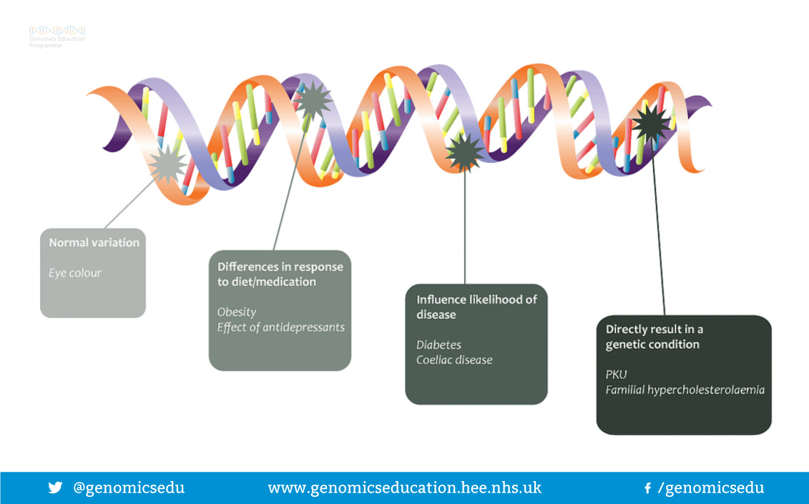

## Central dogma

<iframe width="720" height="480" src="https://www.youtube.com/embed/IjRgC7YYD-M" frameborder="0" allowfullscreen></iframe>

## Encoding

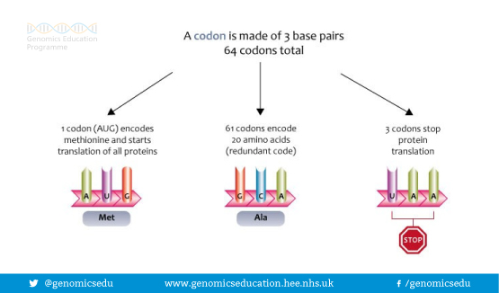

## Nonsense mutation
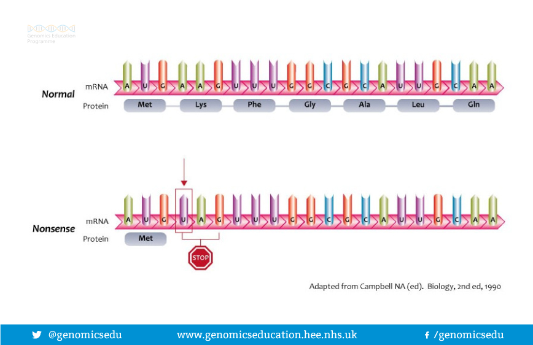

## Mis-sense mutation

## Frame-shift mutation
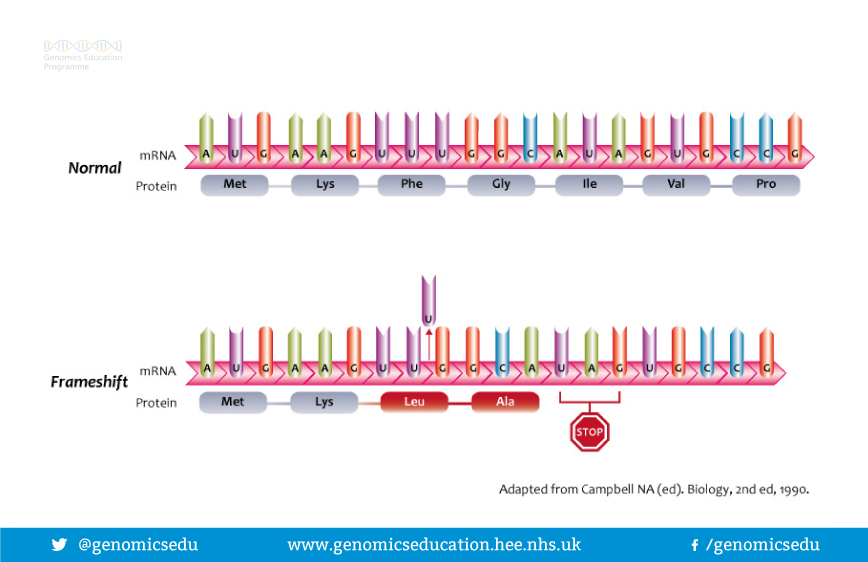

## 體質

## Genetic variant of ALDH2 makes us get a red face after alcohol

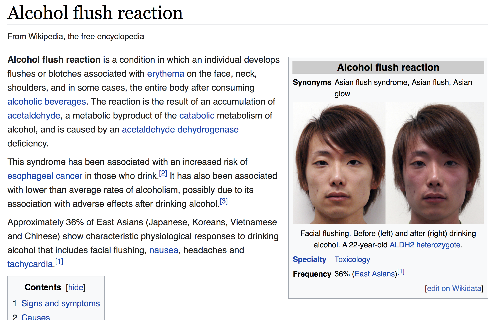

## Some drugs works for parts of people

# Precision Medicine {data-background="img/obama.jpg"}

## Beginning of the story

## The advantages of sequencing technologies

## Growth of sequencing data

## {data-background="black"}

## DNA rain

## Data center?

### To build or not to build, it's a question.

# Cloud

##
### Large bio-data sets should be stored in cloud services

##
### Faster and cheaper
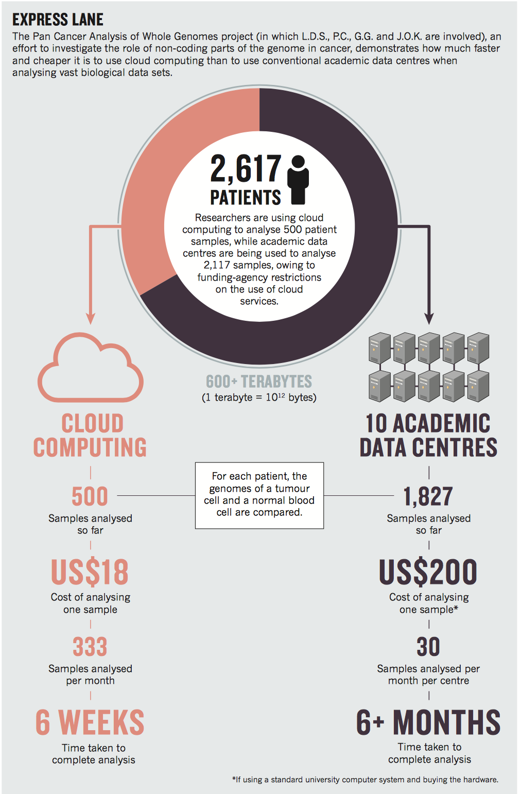

## Google Cloud Platform & Google Genomics
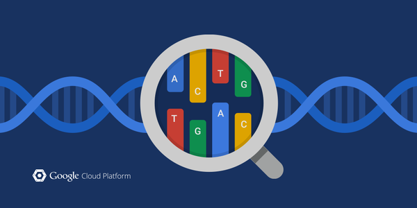

## MSSNG Project (Autism)
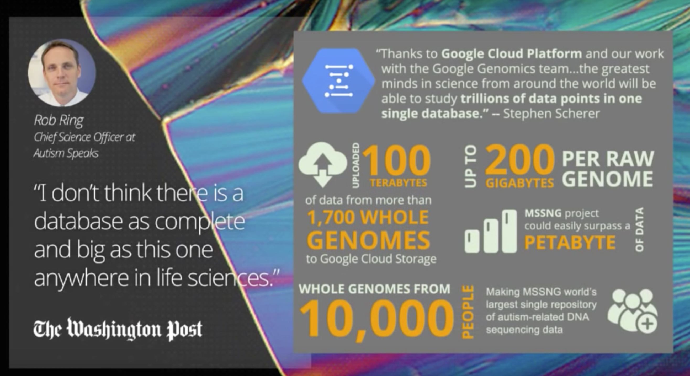

## Million Veteran Project

## Cancer investigation

## Other applications
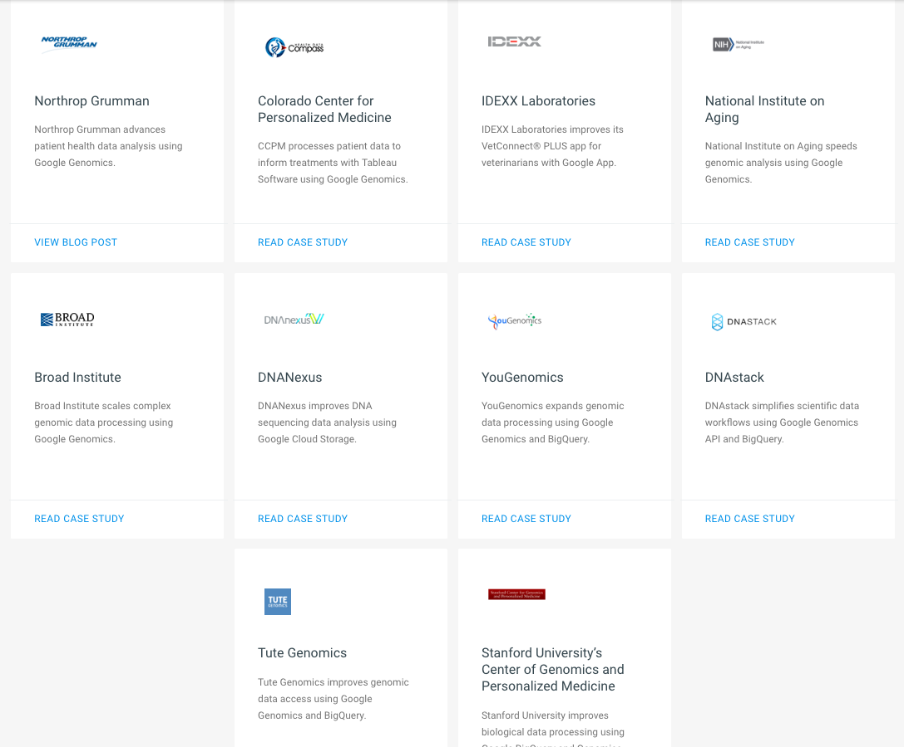

## How Google Genomics works

# How to use Googe Genomics API?

## 
### 萬里之行，始於足下
### 要拿到Genetic variants也得從raw reads開始

## 
### Whole genome sequencing data analysis workflow

DOI: 10.1101/035295

## [Pipeline](https://cloud.google.com/genomics/v1alpha2/pipelines)
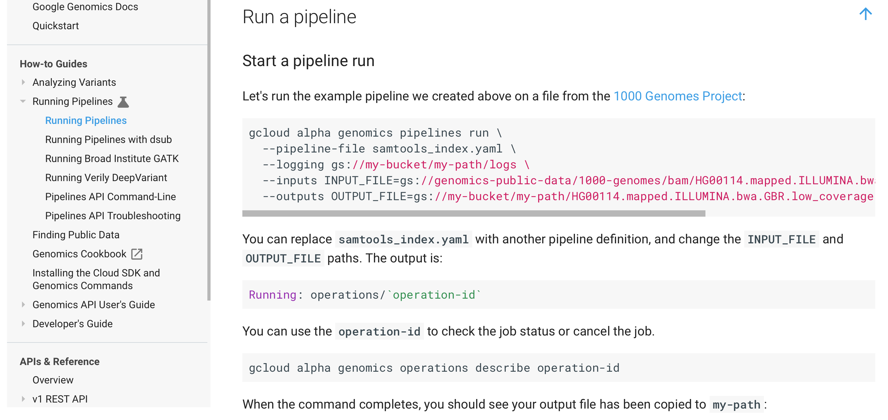

## [Cookbook](http://googlegenomics.readthedocs.io/en/latest/)
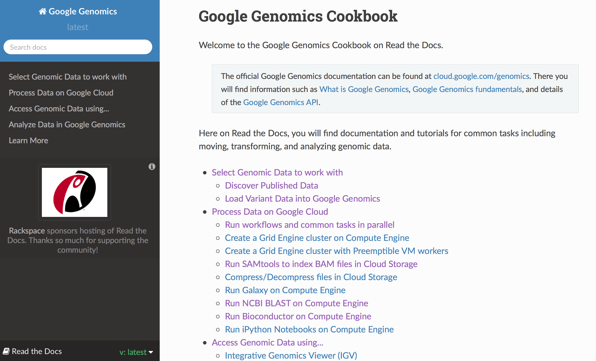

## [ISB-CGC-pipelines](https://github.com/isb-cgc/ISB-CGC-pipelines)
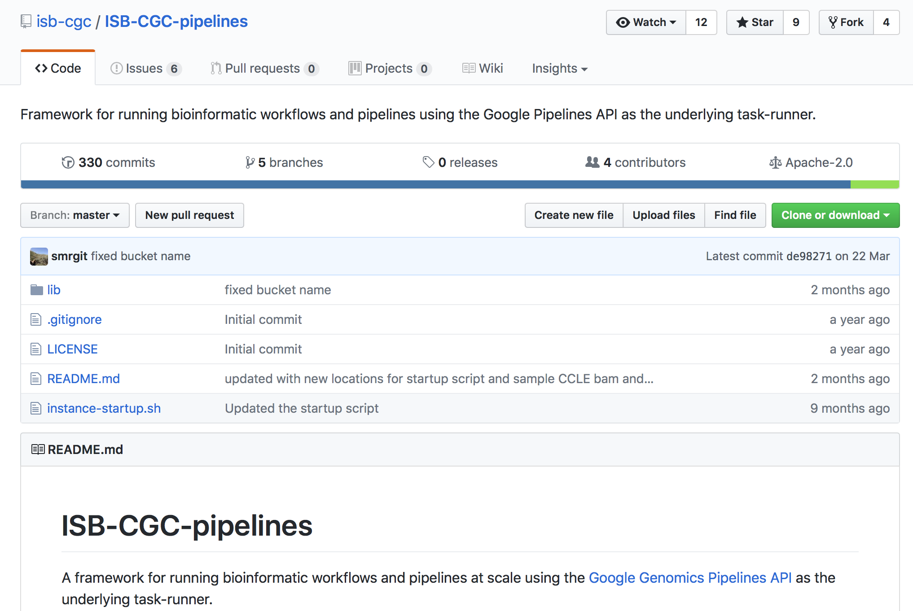

## Workflow Languages

> + CWL (Common Workflow Language)
> + WDL (Workflow Description Language)
> + Others (Makefile, Snakemake, Nextflow and so on)
> + Discussion on [reddit](https://www.reddit.com/r/bioinformatics/comments/4gvou4/experiences_with_workflow_specification_and/)

## [WDL](https://software.broadinstitute.org/wdl/)

## WDL初探
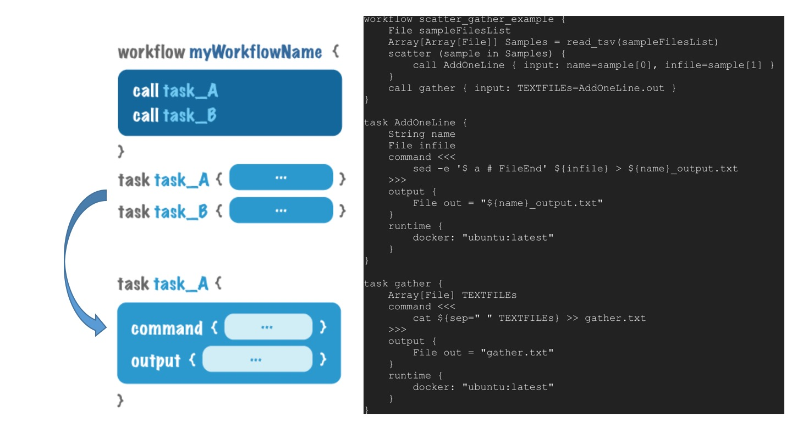

## 
### What is the next? Speed up genomic medicine with AI?

# Bioinformatics-related community

## Taipei Bioinformatics Omnibus (北-BiO)
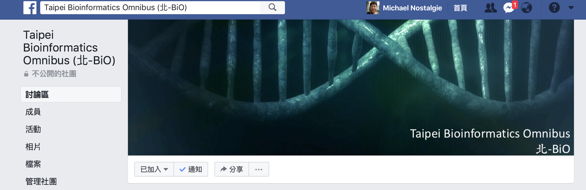

### 社群宗旨：整合、共享、教育、發展

